-   <a href="#first-test-1864" id="toc-first-test-1864">1864 without treatment</a>
    -   <a href="#p-selection" id="toc-p-selection">p selection</a>
    -   <a href="#g-selection" id="toc-g-selection">G selection</a>
    -   <a href="#maximum-discrimination-function"
        id="toc-maximum-discrimination-function">Maximum Discrimination
        Function</a>
-   <a href="#second-test-1864-treated"
    id="toc-second-test-1864-treated">1864 withtreatment</a>
    -   <a href="#p-selection-1" id="toc-p-selection-1">p selection</a>
    -   <a href="#g-selection-1" id="toc-g-selection-1">G selection</a>
    -   <a href="#maximum-discrimination-function-1"
        id="toc-maximum-discrimination-function-1">Maximum Discrimination
        Function</a>

In the first set of PDX lines (PDX line #1864), 21 curves are collected from five serial passages (1 on P1, 2 on P2, 2 on P3, 5 on P4 and 11 on P5). Regrettably, the patient relapsed after six months, at post-chemotherapy surgery, another sample from the same patient was propagated in 17 PDX line obtained from five serial passages. Those were treated with three different drugs carboplatin, gemcitabine and trabectedin.

# First test: 1864

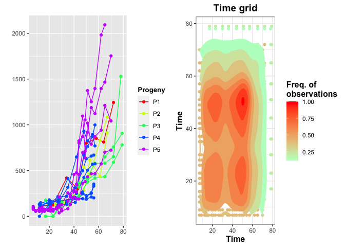

From the plots it is straightforward that we should truncate at time 60.

    #> ############################################################## 
    #> ######## Summary of the trunc. data ############
    #> 
    #>  Number of curves: 17 ;
    #>  Min curve length:  5 ; Max curve length:  21 ;
    #> 
    #>  Number of truncated curves: 10 ;
    #>  Min points deleted:  2 ; Max points deleted:  3 ;
    #> ##############################################################

## p selection

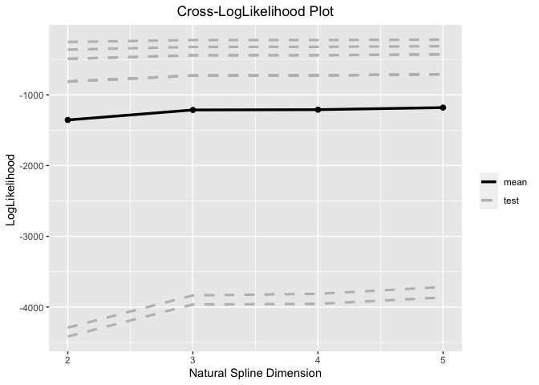

Cross-validated loglikelihood functions.

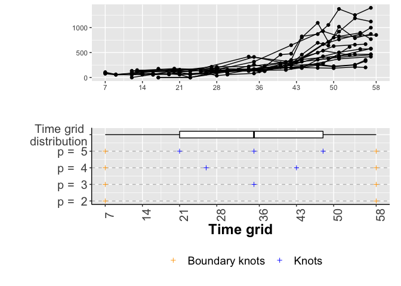

Knots ditribution.

We set p= 3.

## G selection

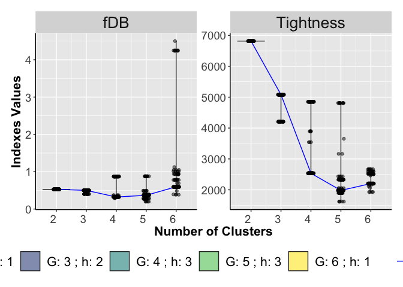

Violin Plots of the  *T* calculated on each run and for different
number of clusters *G* (right panel). Violin Plots of the  fDB
calculated on each run and for different number of clusters *G* (left
panel).

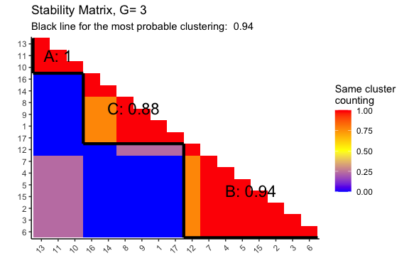

Consensus Matrices for G = 3 and 4.

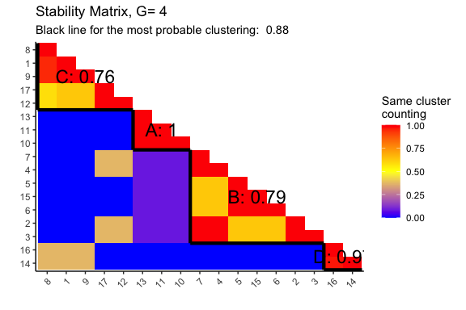

Consensus Matrices for G = 3 and 4.

    #> 
    #> ######## S indexes ############
    #> 
    #> 
    #> |          |         S|       S_1|       S_2|
    #> |:---------|---------:|---------:|---------:|
    #> |Cluster D | 251.47068| 14.232415| 0.5601265|
    #> |Cluster B | 129.01241|  7.123524| 0.3906774|
    #> |Cluster A |  68.13302|  6.692829| 0.3950156|
    #> |Cluster C | 230.75101| 15.838884| 0.8927854|
    #> 
    #> ##############################################################
    #> ############################################################## 
    #> 
    #>         ######## M indexes ############
    #> 
    #> 
    #> |          | Cluster D| Cluster B| Cluster A| Cluster C|
    #> |:---------|---------:|---------:|---------:|---------:|
    #> |Cluster D |     0.000| 2466.4171| 3224.0691|  1334.860|
    #> |Cluster B |  2466.417|    0.0000|  750.9012|  1173.377|
    #> |Cluster A |  3224.069|  750.9012|    0.0000|  1825.671|
    #> |Cluster C |  1334.860| 1173.3771| 1825.6711|     0.000|
    #> 
    #> ##############################################################
    #> ######## R indexes ############
    #> 
    #> 
    #> |          |         R|       R_1|       R_2|
    #> |:---------|---------:|---------:|---------:|
    #> |Cluster D | 0.3612525| 0.2489525| 0.2344041|
    #> |Cluster B | 0.3066051| 0.4058360| 0.8883810|
    #> |Cluster A | 0.2625451| 0.2185301| 0.3130348|
    #> |Cluster C | 0.3612525| 0.4058360| 0.8883810|
    #> 
    #> ##############################################################
    #> ######## fDB indexes ############
    #> 
    #> 
    #> |       fDB|     fDB_1|     fDB_2|
    #> |---------:|---------:|---------:|
    #> | 0.3229138| 0.3197886| 0.5810502|
    #> 
    #> ##############################################################

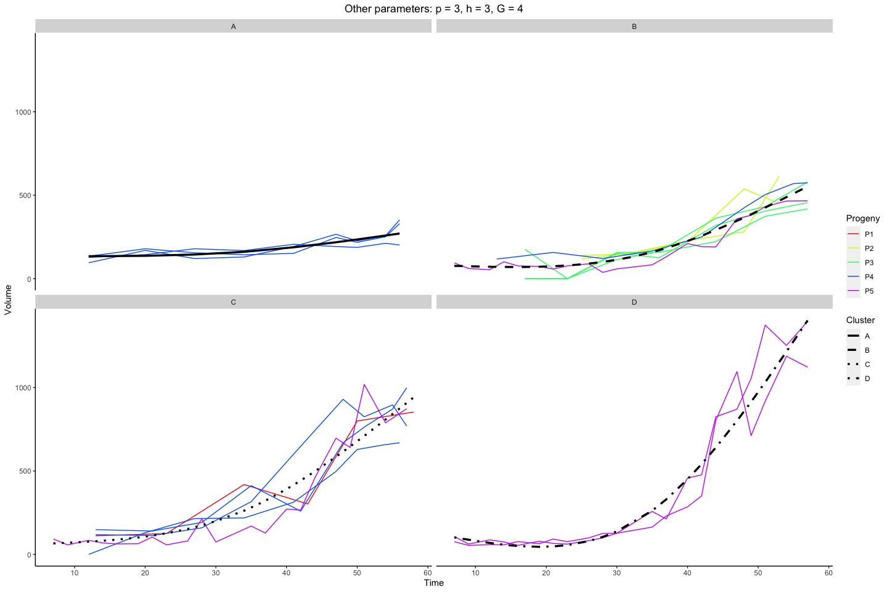

Sampled curves grouped by cluster membership.

## Maximum Discrimination Function

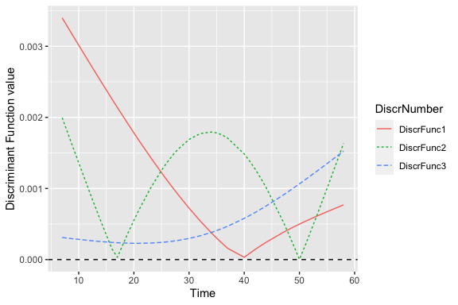

Discriminant curve.

# Second test: 1864 treated

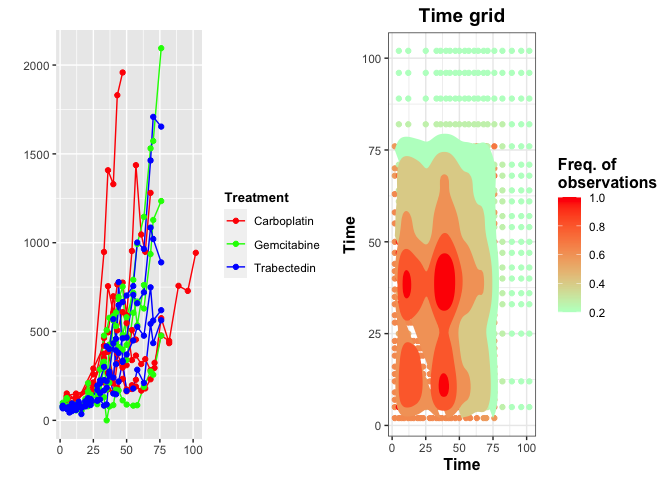

From the plots it is straightforward that we should truncate at time 60.

    #> ############################################################## 
    #> ######## Summary of the trunc. data ############
    #> 
    #>  Number of curves: 14 ;
    #>  Min curve length:  8 ; Max curve length:  22 ;
    #> 
    #>  Number of truncated curves: 11 ;
    #>  Min points deleted:  1 ; Max points deleted:  9 ;
    #> ##############################################################

## p selection

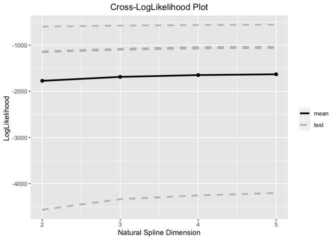

Cross-validated loglikelihood functions.

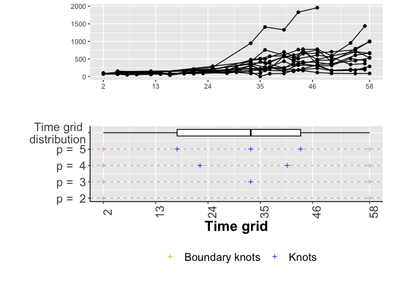

Knots ditribution.

We set p= 3.

## G selection

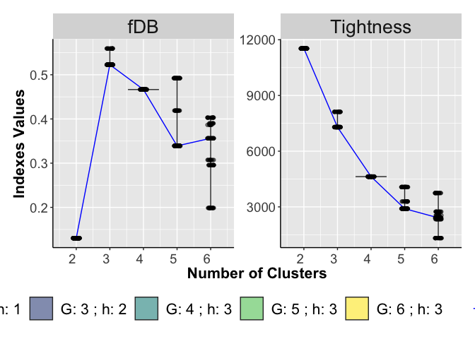

Violin Plots of the  *T* calculated on each run and for different
number of clusters *G* (right panel). Violin Plots of the  fDB
calculated on each run and for different number of clusters *G* (left
panel).

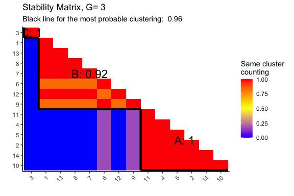

Consensus Matrices for G = 3 and 4.

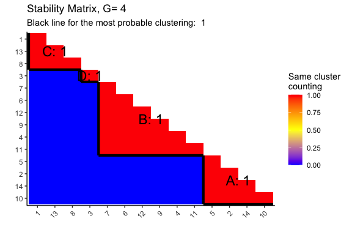

Consensus Matrices for G = 3 and 4.

    #> 
    #> ######## S indexes ############
    #> 
    #> 
    #> |          |        S|      S_1|       S_2|
    #> |:---------|--------:|--------:|---------:|
    #> |Cluster A | 284.2273| 15.15902| 0.8264101|
    #> |Cluster B | 409.9876| 28.09125| 1.5721770|
    #> |Cluster D |   0.0000|  0.00000| 0.0000000|
    #> |Cluster C | 422.0905| 12.83436| 0.4544040|
    #> 
    #> ##############################################################
    #> ############################################################## 
    #> 
    #>         ######## M indexes ############
    #> 
    #> 
    #> |          | Cluster A| Cluster B| Cluster D| Cluster C|
    #> |:---------|---------:|---------:|---------:|---------:|
    #> |Cluster A |     0.000|  1376.841|  9820.849|  2627.686|
    #> |Cluster B |  1376.841|     0.000|  8451.681|  1276.924|
    #> |Cluster D |  9820.849|  8451.681|     0.000|  7197.814|
    #> |Cluster C |  2627.686|  1276.924|  7197.814|     0.000|
    #> 
    #> ##############################################################
    #> ######## R indexes ############
    #> 
    #> 
    #> |          |         R|       R_1|       R_2|
    #> |:---------|---------:|---------:|---------:|
    #> |Cluster A | 0.5042084| 0.6900461| 1.9343282|
    #> |Cluster B | 0.6516271| 0.6900461| 1.9343282|
    #> |Cluster D | 0.0586415| 0.0639037| 0.1096809|
    #> |Cluster C | 0.6516271| 0.4920602| 0.5954346|
    #> 
    #> ##############################################################
    #> ######## fDB indexes ############
    #> 
    #> 
    #> |      fDB|    fDB_1|    fDB_2|
    #> |--------:|--------:|--------:|
    #> | 0.466526| 0.484014| 1.143443|
    #> 
    #> ##############################################################

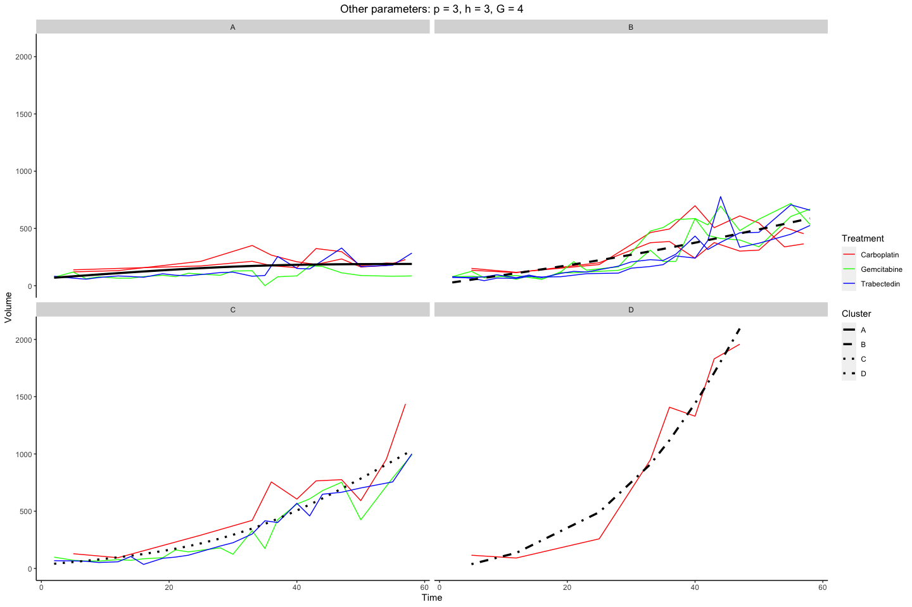

Sampled curves grouped by cluster membership.

## Maximum Discrimination Function

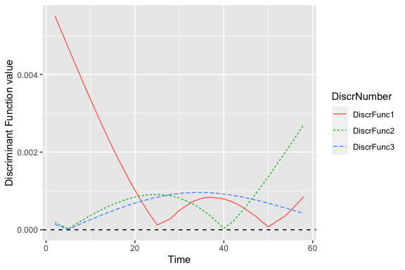 

Discriminant curve.

## Fitting visualizations

# Third test: 1864

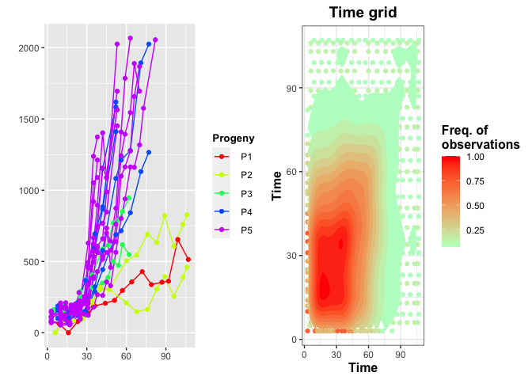

From the plots it is straightforward that we should truncate at time 70.

    #> ############################################################## 
    #> ######## Summary of the trunc. data ############
    #> 
    #>  Number of curves: 21 ;
    #>  Min curve length:  7 ; Max curve length:  16 ;
    #> 
    #>  Number of truncated curves: 6 ;
    #>  Min points deleted:  2 ; Max points deleted:  6 ;
    #> ##############################################################
    #> NULL

## p selection

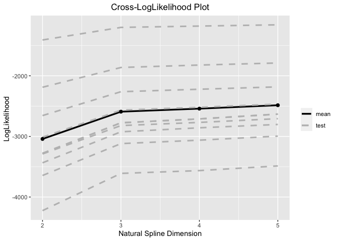

Cross-validated loglikelihood functions.

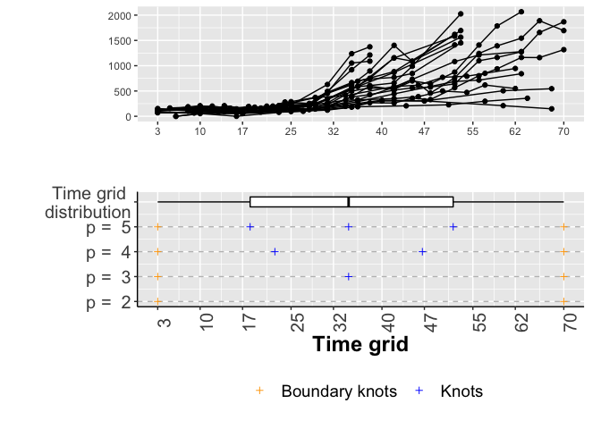

Knots ditribution.

We set p= 3.

## G selection

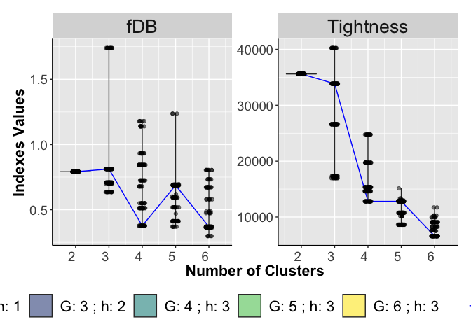

Violin Plots of the  *T* calculated on each run and for different
number of clusters *G* (right panel). Violin Plots of the fDB
calculated on each run and for different number of clusters *G* (left
panel).

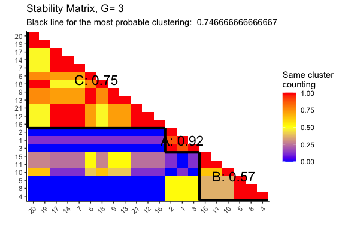

Consensus Matrices for G = 3 and 4.

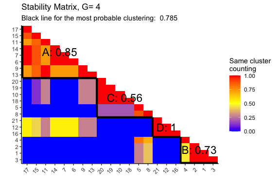

Consensus Matrices for G = 3 and 4.

    #> 
    #> ######## S indexes ############
    #> 
    #> 
    #> |          |        S|      S_1|       S_2|
    #> |:---------|--------:|--------:|---------:|
    #> |Cluster B | 606.2910| 26.12682| 0.8460414|
    #> |Cluster D | 216.1548| 15.82292| 0.1696058|
    #> |Cluster C | 885.1669| 47.96062| 1.9233843|
    #> |Cluster A | 770.7952| 33.38136| 1.0607070|
    #> 
    #> ##############################################################
    #> ############################################################## 
    #> 
    #>         ######## M indexes ############
    #> 
    #> 
    #> |          | Cluster B| Cluster D| Cluster C| Cluster A|
    #> |:---------|---------:|---------:|---------:|---------:|
    #> |Cluster B |     0.000|  21764.75|  3023.052|  7693.948|
    #> |Cluster D | 21764.749|      0.00| 18440.803| 13338.149|
    #> |Cluster C |  3023.052|  18440.80|     0.000|  3704.963|
    #> |Cluster A |  7693.948|  13338.15|  3704.963|     0.000|
    #> 
    #> ##############################################################
    #> ######## R indexes ############
    #> 
    #> 
    #> |          |         R|       R_1|       R_2|
    #> |:---------|---------:|---------:|---------:|
    #> |Cluster B | 0.4933616| 0.4508310| 0.4741507|
    #> |Cluster D | 0.0739945| 0.0796267| 0.0831792|
    #> |Cluster C | 0.4933616| 0.4508310| 0.4741507|
    #> |Cluster A | 0.4469578| 0.4224527| 0.4589958|
    #> 
    #> ##############################################################
    #> ######## fDB indexes ############
    #> 
    #> 
    #> |       fDB|     fDB_1|     fDB_2|
    #> |---------:|---------:|---------:|
    #> | 0.3769189| 0.3509354| 0.3726191|
    #> 
    #> ##############################################################

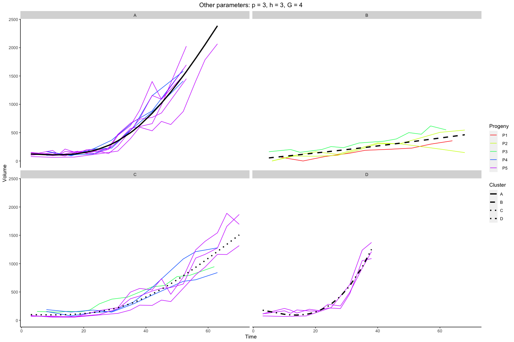

Sampled curves grouped by cluster membership.

## Maximum Discrimination Function

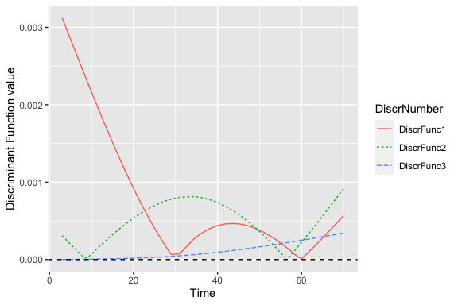

Discriminant curve.

