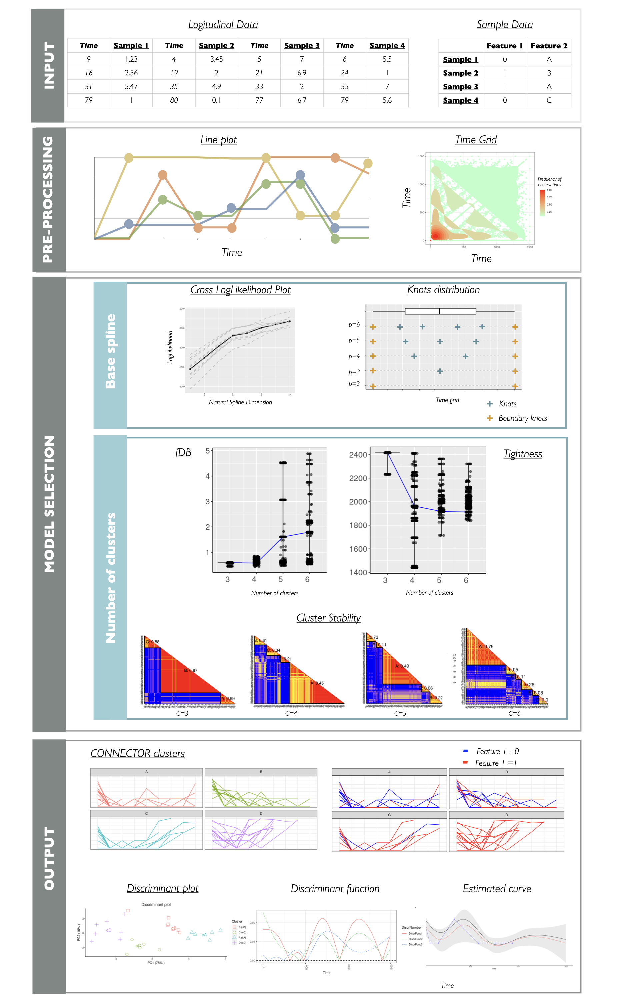

---
layout: single
title: "**CONNECTOR**"
permalink: /framework/
--- 

# Framework

It is a tool for the unsupervised analysis of longitudinal data, that is, it can process any sample consisting of measurements collected sequentially over time. **CONNECTOR** is built on the model-based approach for clustering functional data presented in Sugar and James (2003), which is particularly effective when observations are sparse and irregularly spaced, as growth curves usually are.
The framework pipeline of the **CONNECTOR** package is depicted in Figure.

The four main stages of the data processing are illustrated together with the supporting plots returned by **CONNECTOR**.

1. The **input** data are the sampled curves, which can be also associated with annotation features.
2. Data are **pre-processed** and curves are plotted as lines with dots corresponding to the sampled time points. The heatmap of the full time grid is also provided.
3. The **model selection** is supported by the cross-validated loglikelihoods and the knots positions for the choice of the dimension of the spline basis, and with the functional Davies and Bouldin (fDB) violin plots, the total tightness violin plots and the stability matrices for the choice of the number of clusters. 
4. The **output** of the process is illustrated with the plots of the clustered curves.
