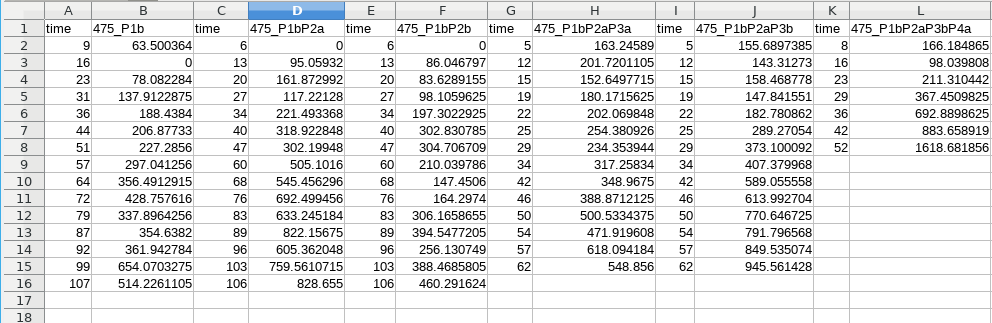
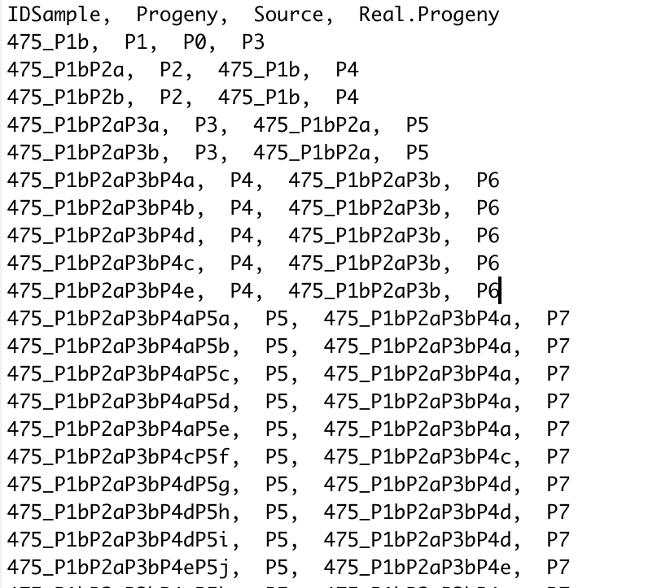

```{r, include = FALSE}
knitr::opts_chunk$set(
  collapse = TRUE,
  comment = "##",
  results = TRUE,
  warning = FALSE,
  message = FALSE,
  highlight = TRUE,
  background = 'grey',
  fig.cap = TRUE
)
rm(list=ls())
```

# Introduction

The time series data continues to be of interest to modelers and experimentalists, since are valuable data from which it is possible to extrapolate useful insights and hypothesis. Thus,
Connector is an R-package for clustering time series (e.g., functional data), built on the model-based approach described by James and Sugar in [@james2003clustering]. Their technique is particularly effective when the data are characterized with sparse and irregularly spaced observations. Several statistical approaches and graphical visualizations are implemented in order to help the user to select the right model and to run the unsupervised clustering algorithm. 
For example, let us consider cancer growth time series, a collection of data which increased constantly in the last years. These data collected starting from different type of biological material, i.e. cancer cell line, patient xenograph models, organoids are used as pre-clinical models to both elucidate the cancer progression and to select the treatments having a good overcome. Then become urgent the identification of an approach able to fit and to cluster the temporal data in order to highlight differences in the dynamics reflecting a divergence in the mechanisms at the basis of the system studied. 

<!-- For a more detailed review on tools and methods developed by the authors on parameter settings, please see [our NM paper].

The main idea is to model individuals curves $g_i$ with basis functions
\begin{equation}\label{eq:gspline}
	g_i(t) = \mathbf{s}(t)^T  \boldsymbol{\eta}_i,
\end{equation}
where $\mathbf{s}(t)$ is a $p-$dimensional spline basis vector and $\boldsymbol{\eta}_i$ is a vector of spline coefficients. The $\boldsymbol{\eta}_i$'s are treated with a random-effects model rather than considering them as parameters and fitting a separate spline curve for each individual. The model is fitted through an EM procedure.

Particular attention will be devoted to model selection. In particular, one must choose the number of clusters to fit, and the dimension of the spline basis. `connector` provides a complete toolkit to lead the user through such decisions, one of the most difficult problems in cluster analysis.  -->


# Installation

The `connector` package is hosted on the GitHub platform. The simplest way to obtain `connector` is to install it using `devtools`. Type the following commands in R console:  

```{r, eval=FALSE}

# Install
install.packages("devtools",repos = "http://cran.us.r-project.org")
library(devtools)
install_github("qBioTurin/connector", ref="master",dependencies=TRUE)
# Load
library(connector)

```

Users may change the `repos` options depending on their locations and preferences. For more details, see `help(install.packages)`.  

```{r, echo=FALSE, results=FALSE}

library(connector)

```

The following packages are required before installing *CONNECTOR*: `devtools`, `dashboardthemes`, `dplyr`, `sfsmisc`, `shinyWidgets`, `viridis`, `ggplotify`.

## Quick Start

A demo is available to provide the list of commands to perform the analysis of the example treated in this tutorial. To run the example just type:  

```{r, eval=FALSE}

demo("MainCommandsList", package = "connector")

```

# Case study: tumor growth dataset

We illustrate the functionalities and the usage of the `connector` package on a tumor growth curves dataset, which is included in the package. The general idea is to identify similar patterns of growth in a data set of $n$ samples (tumor growths). Each sample is a curve (i.e., time series - functional data) characterized by a number of observations taken at different times and irregularly.

## Data description


## Data Importing

### Data Importing by files

The analysis starts from two distinct files.

1. An excel file reporting the discretely sampled curve data. As functional data are longitudinal, we respect the convention of parametrizing the models in terms of time $t$ and y-values $y$. Each sample is represented as two columns of the excel file, the first one named *time* includes the lags list and the second one named with the *ID sample* (each sample has different ID name, for example 475_P1b is the ID name of the first sample in the following figure) includes the list of observed $y$ values. Hence, if we record 24 tumor growth curves, the file have 48 columns. See Figure \ref{fig:xlsx}.

1. A csv (or txt) file containing the annotations associated to the sampled curves. It is composed by a number of rows equal to the number of samples. The first row must be the columns names, in which the first column must collect the *ID sample*, and the remaining ones codify for the annotated features. Notice that the column *ID sample* must contain the same ID names which appear in the excel file of the sampled curves. See Figure \ref{fig:csv}.

{ width=90% }



Once data have been prepared in the two files above described, they are imported by the `DataImport` function. Two arguments, with the file names respectively, should be specified. In this example the full path names have been saved in the `TimeSeriesFile` and `AnnotationFile` strings.

```{r}

# find the full path names of the example files
TimeSeriesFile<-system.file("data", "475dataset.xlsx", package = "connector")
AnnotationFile <-system.file("data", "475info.txt", package = "connector")
# import the samples
CONNECTORList<-DataImport(TimeSeriesFile = TimeSeriesFile,
                          AnnotationFile = AnnotationFile)

```

A list of four object is created:

```{r}

# show the CONNECTORList structure
str(CONNECTORList)

```

The components of the `CONNECTORList` are:

1. `$Dataset`, a data frame with three variables: `ID` of the curve, `Observation` the $y$ values and `Time` the time lags;

2. `$LenCurv`, the vector of the number of observations per sample;

3. `$LabCurv`, a data frame matching the sample with the corresponding annotated features. Hence the variables are extracted and named from the `AnnotationFile`;

4. `$TimeGrid`, the vector of the complete time grid points.

### Data importing by data.frame
 
Instead of using two files, two data frames can be exploited to generate `CONNECTORList`. Specifically

1. *TimeSeriesFrame*: dataframe of three columns storing the time series. The first columns, called "\emph{ID}", stores the identification number of each sample. The second column, labeled "\emph{Observation}", contains  the observations over the time and the respective time point is reported in the third column, labeled  "\emph{Time}";

2. *AnnotationFrame*: dataframe with a number of rows equal to the number of samples in the *TimeSeriesFrame*. The first column must be named "\emph{ID}" and it stores the identification numbers exploited for the matching with the samples saved in the *TimeSeriesFrame*. Then it is possible to add a column per feature to consider and to associate with the respective sample (depending on the identification number in the first column). If NULL, then in the `CONNECTORList` only the feature \emph{ID} will be reported.

Hence, `CONNECTORList` can be generated by exploiting the *DataFrameImport* function.

```{r,eval=F}

# show the CONNECTORList structure
CONNECTORList <- DataFrameImport(GrowDataFrame = GrowDataFrame,
                                 AnnotationFrame = AnnotationFrame)
                                

```


## Data Visualization 

The `PlotTimeSeries` function provides a plot of the sampled curves, coloured by a user selected feature out of the ones given in the `AnnotationFile`. In Figure \ref{fig:PlotTimeSeries} an example is illustrated, that has been produced by the following code:

```{r, results="hide", fig.cap="Sampled curves, coloured by progeny feature. \\label{fig:PlotTimeSeries}"}

CurvesPlot<-PlotTimeSeries(data = CONNECTORList,
                      feature = "Progeny")
CurvesPlot

```

As we can see from \ref{fig:PlotTimeSeries}, only few samples have observations at the last time points. Since data may be irregularly and sparsely sampled like this, as a preliminary step, it may be useful to check whether the data are sufficiently dense in the domain plane. In this context, the `DataVisualization` function plots the sampled curves together with the density grid to eventually decide for truncation, since low-density subregions may be excluded from the analysis, In this contest, the function `DataTruncation` have been developed to truncate the time series into a specific time interval. 

```{r, fig.height = 3, fig.width = 7, fig.align = "center", fig.cap="Sampled curves, coloured by progeny feature (left panel) and time grid density (right panel). \\label{fig:gridDensity}"}

# Growth curves and time grid visualization 
Datavisual<-DataVisualization(data = CONNECTORList,
                              feature = "Progeny", 
                              labels = c("Time","Volume","Tumor Growth"))
Datavisual

```

```{r, echo=F}

tronca = 70

```

Specifically, in Figure \ref{fig:gridDensity} the time grid density is showed, in which a point $p_{x,y}$ is defined by a pair of coordinates $p_{x,y}=\left( x,y\right) \ $ and by a colour. $p_{x,y}$ is defined if only if exists at least one sample with two observations at time $x\ $ and $y$. The colour associates with it encodes the frequency of samples in which $p_{x,y}$ is present. 
Therefore, according to Figure \ref{fig:gridDensity} we decide to truncate the observations at `r tronca` days.

```{r}

# data truncation
trCONNECTORList<-DataTruncation(data = CONNECTORList,
                              feature="Progeny",
                              truncTime = 70,
                              labels = c("Time","Volume","Tumor Growth"))
# the trCONNECTORList structure
str(trCONNECTORList, max.level = 1)

```

The output of the function `DataTruncation` is a list of six objects. The first four of which are the truncated versions of the `DataImport` function. The plot stored in `$PlotTimeSeries_plot` shows the sampled curves plot with a vertical line at the truncation time, see Figure \ref{fig:truncation}.

```{r, fig.cap="Sampled curves, coloured by progeny feature and truncation lag (vertical solid black line). \\label{fig:truncation}"}

# plot
trCONNECTORList$PlotTimeSeries_plot

```


## Model Selection Tools

Before running the fitting and clustering approach, we have to properly chose the two free parameters:

1. the spline basis dimension, $p$;

2. the number of clusters, $G$.

We developed a tool set of functions to guide the user through the identification of each of the above parameters. Let us stress out that rough choices for the free parameters may compromise the full analysis. 

### The spline basis dimension - p

The dimension of the spline basis can be chose by exploiting the `BasisDimension.Choice` function, by taking the $p \in [p_{min}, p_{max}]$ value corresponding to the largest cross-validated likelihood, as proposed in [@james2000principal], where the interval of values $[p_{min}, p_{max}]$ is given by the user. In particular, we implemented a ten-fold cross-validation, which involves splitting data into 10 roughly equal-sized parts, fitting the model to 9 parts and calculating the log-likelihood on the excluded part, repeat 10 times and combine log-likelihoods. Finally, the function returns the plot of the mean tested log-likelihoods versus the dimension of the basis. Notice that the resulting plot should be treated as a guide for choosing the largest cross-validated likelihood rather than an absolute rule, keeping in mind that working with sparse data pushes to spare parameters. 

In details two plots are returned:

1. The `$CrossLogLikePlot` gives a visual representation of the results, see Figure \ref{fig:crossloglike}. Each gray dashed line corresponds to the cross-log-likelihood values obtained on different test/learning sets and the solid black line is their mean value. The user should choose the smallest value of `p` that ensures larger values of the mean cross-log-likelihood function. 

2. The `$KnotsPlot` shows the time series curves (upper plot) together with the knots (the values of where the pieces of polynomial defining the spline meet) distribution over the time grid (lower plot). Specifically, the lower plot is characterized by one horizontal line for each $p$ value passed in input to the function, and following this line it is showed how the knots, defining the spline of dimension $p$ (i.e., in how many intervals th time grid will be divided), are distributed over the time grid defined by the input curves. The user should choose $p$ such that the number of cubic polynomials (i.e., $p-1$) defined in each interval is able to follow the curves dynamics.


```{r, fig.height = 3, fig.width = 7, fig.align = "center",fig.cap="Cross-validated loglikelihood functions. \\label{fig:crossloglike}"}

# ten-fold cross-validation 
CrossLogLike<-BasisDimension.Choice(data = trCONNECTORList,
                                    p = 2:6 )
CrossLogLike$CrossLogLikePlot

```

```{r, fig.height = 8, fig.width = 7, fig.align = "center",fig.cap="Knots ditribution. \\label{fig:Knotscrossloglike}"}

CrossLogLike$KnotsPlot
# set p
p <- 3

```

Hence, in the current example, we set $p=3$, as it is the smallest value that ensures a large log-likelihood.

### The number of clusters - G

'connector' provides two different plots to properly guide in one of the most difficult problems in cluster analysis: setting properly the number of clusters. As in the finite-dimensional case, where data are points in place of curves, we need some proximities measures to validate and compare results of a clustering procedure. 
In [qui rif al nostro paper] we introduced two measures of proximity, the *total tightness* $T$ and the *functional Davied-Bouldin index* $fDB$. Both measures rely on on the family of semi-metrics between curves defined as
\begin{equation}\label{eq:qsemimetrics}
	D_q(f,g) = \sqrt{ \int \left| f^{(q)}(s)-g^{(q)}(s) \right|^2 ds }, \qquad q=0,1,2,
\end{equation} 
where $f$ and $g$ are two curves and $f^{(q)}$ and $g^{(q)}$ are their $q$th derivatives. 
Note that for $q=0$, eq. \eqref{eq:qsemimetrics} is the distance induced by the classical $L^2-$norm. It turns out that $D_q$ can be reliably calculated in our setting where we are interested in proximity measures between curves and center-curves for each cluster (tightness of the cluster),  as well as center-curve and center-curve of different clusters (separateness of clusters). Hence we may have $f$ being the estimated $i$th curve and $g$ being the estimated mean curve of cluster $k$, or $f$ and $g$ being both mean curves. In any case $D_q$ can be calculated taking advantage of the spline representation of the estimated curves and mean curves, see eq. \eqref{eq:gsplinepred}.

The *total tightness* $T$ is the dispersion measure defined as
\begin{equation}\label{eq:totalT}
	 T = \sum_{k=1}^G \sum_{i=1}^n D_0(\hat{g}_i, \bar{g}^k),
\end{equation}
where $\hat{g}_i$ is the estimated $i$--th curve given in eq. \eqref{eq:gsplinepred} and $\bar{g}^k$ is the center of $k$--th cluster given in eq. \eqref{eq:splinemeancurve}.

As the number of clusters increases, the total tightness decreases to zero, the value which is attained when the number of fitted clusters equals the number of sampled curves. In this limiting case, any $k$th cluster mean curve coincides with an estimated curve and $D_0(\hat{g}_i, \bar{g}^k) = 0$ for any $i$ and $k$.

A proper number of clusters can be inferred as large enough to let the total tightness drop down to relatively little values but as the smallest over which the total tightness does not decrease substantially. Hence, we look for the location of an ``elbow" in the plot of the total tightness against the number of clusters. 


The second index, which is a cluster separation measure, is called *functional David Bouldin* (fDB) index. Specifically, we defined it as follows
\begin{equation}\label{eq:fDB}
	\mbox{fDB}_q = \frac{1}{G} \sum_{k_1=1}^G \max_{k_2 \neq k_1} \left\{  \frac{S_{k_2} + S_{k_2}}{M_{k_2k_1}}  \right\},
\end{equation} 
where, for each cluster $k_1$ and $k_2$ 
\begin{equation*}
	S_k = \sqrt{\frac{1}{G_k} \sum_{i=1}^{G_k} D_q^2(\hat{g}_i, \bar{g}^k)} \qquad \mbox{and} \qquad  M_{k_2k_1} =  D_q(\bar{g}^{k_2}, \bar{g}^{k_1}),
\end{equation*}
with $G_k$ the number of curves in the $k$th cluster. The significance of eq. \eqref{eq:fDB} can be understood as the average of the blend measures of each cluster from its most overlapping cluster. The optimal choice of clusters, then, will be that which minimizes this average blend. 

Furthermore, the random initialization of the k-means algorithm to get initial cluster memberships into the FCM algorithm and the stochasticity characterizing the method lead to some variability among different runs. For these reasons, multiple runs (we suggest greater than 50, the default value, but it depends on the size and the variability of the dataset under analysis) are necessary to identify the most frequent clustering fixed a number of clusters ($G$).

To effectively take advantage of those two measures, `connector` supplies the function `ClusterAnalysis` which repeats the clustering procedure a number of times equal to the parameter `runs` and for each of the number of clusters given in the parameter `G`. The output of the function is a list of three objects,

1. `$Clusters.List`: the list of all the clustering divisions obtained varying among the input $G$ values;

2. `$seed`: the seed sets before running the method;

3. `$runs`: the number of runs.

Specifically, the object storing the clustering obtained with $G=2$ (i.e., `ClusteringList$Clusters.List$G2`) is a list of three elements:

1. `$ClusterAll`: the list of all the possible FCM parameters values (see Sec. *Details on the functional clustering model*) that can be obtained through each run. In details, the item `$ParamConfig.Freq` reports the number of times that the respectively parameters configuration (stored in `$FCM`) is found. Let us note thaty the sum might be not equal to the number of runs since errors may occur;

2. `$ErrorConfigurationFit`: list of errors that could be obtained by running the FCM method with extreme parameters configurations;

3. `$h.selected`:  the dimension of the mean space, denoted as $h$, selected to perform the analysis. In details, this parameter gives a further parametrization of the mean curves allowing a lower-dimensional representation of the curves with means in a restricted subspace. Its value is choose such that the inequality $h \le \min(G-1,\ p)$ holds. Better clusterings are obtained with higher values of $h$, but this may lead to many failing runs. In this cases $h$ values is decreased until the number of successful runs are higher than a specific constraint which can be defined by the user (by default is $100\%$ of successful runs).


```{r,message=FALSE, eval=FALSE}

ClusteringList <-ClusterAnalysis(data = trCONNECTORList,
                                 G = 2:5,
                                 p = p,
                                 runs = 100)

```

```{r,message=FALSE,echo=F}
ClusFile <- "Clustering.RData"
if(!file.exists(ClusFile))
{
ClusteringList <-ClusterAnalysis(data = trCONNECTORList,
                                 G = 2:5,
                                 p = p,
                                 runs = 100)
  
  save(ClusteringList, file =ClusFile)
}else{
  load(ClusFile)
}

G=3
```

```{r}
# the output structure
str(ClusteringList, max.level = 2, vec.len=1)
str(ClusteringList$Clusters.List$G2, max.level = 3, vec.len=1)
```

By means of the function `IndexesPlot.Extrapolation` the two plots represented in Figure \ref{fig:TandfDB} can be generated from `ClusteringList`. In details, the tightness and fDB indexes are plotted for each value of $G$. The vertical lines associated with each $G$ are violin plots in which the points represent the index values for the respectively runs. The blu line shows the most probable configuration
which will be exploited hereafter.


```{r, fig.height = 7, fig.width = 16, fig.align = "center",fig.cap="\\label{fig:TandfDB} Violin Plots of the {\\it total tightness} $T$ calculated on each run and for different number of clusters $G$ (right panel). Violin Plots of the {\\it functional DB index} fDB calculated on each run and for different number of clusters $G$ (left panel)."}

IndexesPlot.Extrapolation(ClusteringList)-> indexes
indexes$Plot
```

<!-- The indexes show that $G=3$ and $G=4$ may be good choices for the parameter. Specifically, the right panel shows that $G=3$ may be good choice for the parameter, while the fDB indexes plotted in the left panel lead the choice to $G=4$, a number of clusters that explicitly minimizes the fDB index. -->

The indexes show that $G=4$ is a good choices, since it is the number of clusters that represents the elbow for the tightness indexes (plotted in the right panel) and explicitly minimizes the fDB indexes (plotted in the left panel).

The variability of the two measures among runs, exhibited in Figure \ref{fig:TandfDB}, is related to the random initialization of the k-means algorithm to get initial cluster memberships from points. The stability of the clustering procedure can be visualized through the consensus matrix extrapolated by the function `ConsMatrix.Extrapolation`, as shown in Figure \ref{fig:ConsMatg4}.
Let us note that the number associated with each cluster in the consensus matrix represents the average number of time that the curves belonging to the same cluster are counted in the most probable cluster; while the average of these indexes is reported in the title.

```{r, fig.height =3, fig.width = 4, fig.align = "center",fig.cap=c("\\label{fig:ConsMatg4} Consensus Matrices for G = 4.")}

ConsMatrix<-ConsMatrix.Extrapolation(stability.list = ClusteringList)
str(ConsMatrix, max.level = 2, vec.len=1)

ConsMatrix$G4$ConsensusPlot

```

<!-- Hence, given the higher stability of the cluster membership among the curves, we are choosing $G=4$ for the illustrated example. -->

Once the free parameters are all set, the function `MostProbableClustering.Extrapolation` can be used to fix the most probable clustering with given dimension of the spline basis $p$, and number of clusters $G$ and save the result in a dedicated object.

```{r, fig.height = 6, fig.width = 6, fig.align = "center", out.width= '90%'}

CONNECTORList.FCM.opt<-MostProbableClustering.Extrapolation(
                                                  stability.list = ClusteringList,
                                                  G = G )
```

## Results Visualization and Inspection

`connector` provides the function `ClusterWithMeanCurve` which plots the sampled curves grouped by cluster membership, together with the mean curve for each cluster, see Figure \ref{fig:clusters}. The function prints as well the values for $S_h$, $M_{hk}$ and fDB given in equation \eqref{eq:fDB}.

```{r, fig.height = 10, fig.width = 15, fig.align = "center", fig.cap="\\label{fig:clusters} Sampled curves grouped by cluster membership."}

FCMplots<- ClusterWithMeanCurve(clusterdata = CONNECTORList.FCM.opt,
                                feature = "Progeny",
                                labels = c("Time","Volume"),
                                title = "FCM model")

```

A detailed visualization of the clusterization of the sample curves can be obtained by means of the `DiscriminantPlot` function. In [@james2003clustering], the authors describe how to obtain low-dimensional plots of curve datasets, enabling a visual assessment of clustering. They propose to project the curves into the lower dimensional space of the mean space, so that they can be plotted as points (with coordinates the functional linear discriminant components), making it much easier to detect the presence of clusters. In details, when $h$ is equal to 1 or 2, than the `DiscriminantPlot` function return the plots of the curves projected onto the $h$ dimensional mean space: 

1. when $h=1$, the functional linear discriminant $\\alpha_1$ is plotted versus its variability;
2. when $h=2$, the functional linear discriminant $\\alpha_1$ is plotted versus the functional linear discriminant $\\alpha_2$.

If $h > 2$, the principal component analysis is exploited to extrapolate the components of the $h$-space with more explained variability (which is reported in brackets), that are then plotted together. 


In the case study here described, we get the plots in Figure \ref{fig:DiscrPlotCL} which is colored by cluster membership and in Figure \ref{fig:DiscrPlotF} which is colored by the user selected feature called `"Progeny"`.

```{r, fig.height = 4, fig.width = 6, fig.align = "center",fig.cap=c("\\label{fig:DiscrPlotCL} Curves projected onto the 3-dimensional mean space: symbols are coloured by cluster membership.", "\\label{fig:DiscrPlotF} Curves projected onto the 3-dimensional mean space: symbols are coloured by progeny.") }

DiscrPlt<-DiscriminantPlot(clusterdata = CONNECTORList.FCM.opt,
                           feature = "Progeny")

DiscrPlt$ColCluster
DiscrPlt$ColFeature

```

Furthermore, it is possible to visualize and save the fitting obtained exploiting the algorithm for each curve in the dataset, using the `Spline.plots` function.

```{r, fig.height = 4, fig.width = 6, fig.align = "center",fig.cap=c("\\label{fig:Spline} Fitting of the Sample with ID = 1: in blue the observations characterinzing the curve, in red the estimated spline from the fitting, and in black the mean curve of the associated cluster. The grey area represents the confidence interval.") }

PlotSpline = Spline.plots(FCMplots)
PlotSpline$`1`

```

In the end, to inspect the composition of the clusters, the function `CountingSamples` reports the number and the name of samples in each cluster according to the feature selected by the user.

```{r, fig.height = 4, fig.width = 6, fig.align = "center"}

NumberSamples<-CountingSamples(clusterdata = CONNECTORList.FCM.opt,
                               data = trCONNECTORList,
                               feature = "Progeny")

str(NumberSamples, max.level = 2)

```

### Maximum Discrimination Function

In [@james2003clustering] the authors suggest to consider all the information about the traits that distinguish one cluster from another. In particular, they calculate the optimal weights to apply to each dimension for determining cluster membership, as shown in Figure \ref{fig:discrimination}. 

```{r, fig.height = 4, fig.width = 6, fig.align = "center", fig.cap="\\label{fig:discrimination} Discriminant curve."}

MaxDiscrPlots<-MaximumDiscriminationFunction(clusterdata = CONNECTORList.FCM.opt)

MaxDiscrPlots[[1]]

```

Large absolute values correspond to large weights and hence large discrimination between clusters. Roughly speaking Figure \ref{fig:discrimination} tells us that earlier measurements are important in determining cluster assignment as well as latter ones.


<!-- # Details on the functional clustering model  -->

<!-- The curves, $g_i(t)$ for each $i$th selected individual, are supposed to be observed with measurement errors and only at few discrete time points. Hence the vector $\mathbf{Y}_i$ of observed values at times $t_{i_1}, \dots , t_{i_{n_i}}$ is given as -->
<!-- \begin{equation*} -->
<!-- 	\mathbf{Y}_i = \mathbf{g}_i + \boldsymbol{\varepsilon}_i, -->
<!-- \end{equation*} -->
<!-- where $\mathbf{g}_i$  and $\boldsymbol{\varepsilon}_i$ are the vectors of true values and measurement errors at time grid, respectively. As there are only finite number of observations, individual curves are modeled using basis functions, in particular cubic splines. Let -->
<!-- \begin{equation}\label{eq:gspline} -->
<!-- 	g_i(t) = \mathbf{s}(t)^T  \boldsymbol{\eta}_i, -->
<!-- \end{equation} -->
<!-- where $\mathbf{s}(t)$ is a $p-$dimensional spline basis vector and $\boldsymbol{\eta}_i$ is a vector of spline coefficients. The $\boldsymbol{\eta}_i$'s are treated with a random-effects model rather than considering them as parameters and fitting a separate spline curve for each individual. Cluster means are furthermore rewritten as -->
<!-- \begin{equation*} -->
<!-- 	\boldsymbol{\mu}_{k} = \boldsymbol{\lambda}_0 + \Lambda \boldsymbol{\alpha}_k, -->
<!-- \end{equation*} -->
<!-- where $\boldsymbol{\lambda}_0$ and $\boldsymbol{\alpha}_k$ are $p-$ and $h-$ dimensional vectors, $\Lambda$ is a $(p,h)$ matrix and $h \leq \min(p,G-1)$, where $G$ denote the true number of clusters. This parametrization allows a lower-dimensional representation of the curves with means in a restricted subspace (for $h < G-1$). -->

<!-- With this formulation, the functional clustering model can be written as -->
<!-- \begin{eqnarray} -->
<!-- 	\mathbf{Y}_i =S_i  \cdot ( \boldsymbol{\lambda}_0 + \Lambda \boldsymbol{\alpha}_{\mathbf{z}_i} +  \boldsymbol{\gamma}_i) +  \boldsymbol{\varepsilon}_i, \quad i=1, \dots, n,\nonumber\\ -->
<!-- 	\boldsymbol{\varepsilon}_i \sim  \mathcal{N} (\mathbf{0},R), \quad  \boldsymbol{\gamma}_i \sim   \mathcal{N} (\mathbf{0},\Gamma), \qquad \qquad -->
<!-- \end{eqnarray} -->
<!-- where $S_i = (\mathbf{s}(t_{i_1}),\dots,\mathbf{s}(t_{i_{n_i}}))^T$ is the spline basis matrix for the $i-$th curve.  -->

<!-- The model is fitted following [@james2003clustering] and all the estimated parameters and the predicted cluster membership are returned. Notice that the $k$th cluster mean curve can be retrieved as -->
<!-- \begin{equation}\label{eq:splinemeancurve} -->
<!-- 	\bar{g}^k(t) = \mathbf{s}(t)^T ( \hat{\boldsymbol{\lambda}}_0 + \hat{\Lambda} \hat{ \boldsymbol{\alpha}}_k). -->
<!-- \end{equation} -->
<!-- Moreover, the functional clustering procedure can accurately predict unobserved portions of the curves $g_i(t)$ by means of the natural estimate -->
<!-- \begin{equation}\label{eq:gsplinepred} -->
<!-- 	\hat{g}_i(t) =  \mathbf{s}(t)^T  \hat{\boldsymbol{\eta}}_i, -->
<!-- \end{equation} -->
<!-- where $\hat{\boldsymbol{\eta}}_i$ is a prediction for $\boldsymbol{\eta}_i$ which is proven to be optimally computed as $\mathbb{E}( \boldsymbol{\eta}_i \;|\; \mathbf{Y}_i)$ and explicitly given in [@james2003clustering], eq. (17).  -->

# References

---
nocite: |
  @ClassicalModels
...